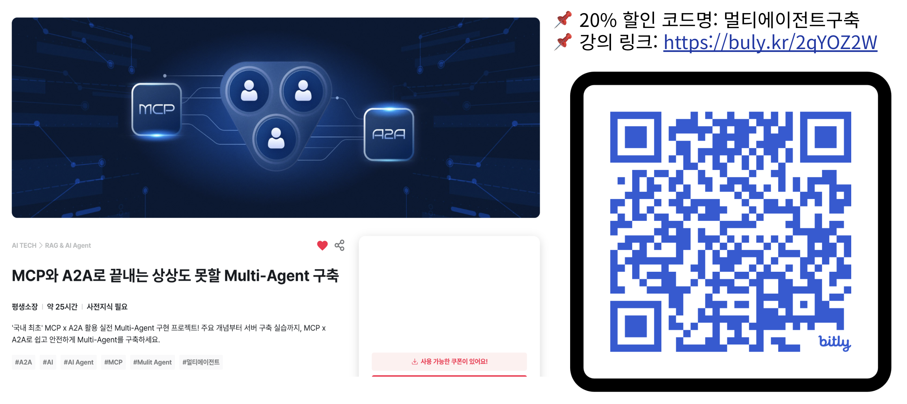

# MCP 와 A2A 로 개발하는 Multi Agent

FastCampus 온라인강의 “MCP 와 A2A 로 개발하는 Multi Agent”(Part2 - Chapter2. LangGraph와 MCP & A2A) 실습 저장소입니다. 본 저장소는 Step 1 → 4를 순서대로 따라가면 멀티 에이전트 시스템이 완성되도록 구성되어 있습니다.



---

## 프로젝트 개요 및 인덱스

- 전체 인덱스: [code_index.md](code_index.md)
- 소스 인덱스 허브: [src/code_index.md](src/code_index.md)
- 하위 모듈 인덱스
  - A2A 통합: [src/a2a_integration/code_index.md](src/a2a_integration/code_index.md)
  - 설정: [src/config/code_index.md](src/config/code_index.md)
  - HITL 코어: [src/hitl/code_index.md](src/hitl/code_index.md)
  - HITL 웹: [src/hitl_web/code_index.md](src/hitl_web/code_index.md)
  - LangGraph 에이전트: [src/lg_agents/code_index.md](src/lg_agents/code_index.md)
  - MCP 서버: [src/mcp_servers/code_index.md](src/mcp_servers/code_index.md)
  - 유틸리티: [src/utils/code_index.md](src/utils/code_index.md)

항상 인덱스를 최신 소스로 신뢰합니다.
불일치를 발견하면 인덱스를 먼저 갱신하고 코드를 정리하세요.

---

## 요구 사항

- Python 3.12+
- [uv 패키지 매니저](https://docs.astral.sh/uv/getting-started/installation/)
- Docker / Docker Compose (MCP 서버 및 Redis 실행용)

권장 라이브러리/버전(정확한 버전은 `pyproject.toml` 참고):
(2025.08.08 기준 최신 버전)

- LangGraph v0.6.4
- FastMCP v2.11.2
- LangChain MCP Adapters v0.1.9
- a2a-sdk v0.3.0

참고 문서 모음: `docs/`

- LangGraph-LLMs: [docs/langgraph-llms_0.6.2.txt](docs/langgraph-llms_0.6.2.txt), [docs/langgraph-llms-full_0.6.2.txt](docs/langgraph-llms-full_0.6.2.txt)
- FastMCP: [docs/fastmcp-llms_2.11.0.txt](docs/fastmcp-llms_2.11.0.txt), [docs/fastmcp-llms-full_2.11.0.txt](docs/fastmcp-llms-full_2.11.0.txt)
- A2A: [docs/a2a-python_0.3.0.txt](docs/a2a-python_0.3.0.txt), [docs/a2a-samples_0.3.0.txt](docs/a2a-samples_0.3.0.txt)
- 다이어그램 인덱스: [docs/diagrams/code_index.md](docs/diagrams/code_index.md)

---

## 설치 및 환경설정

1. 의존성 설치(uv)

```bash
uv venv
uv sync
```

1. 루트 `.env` 생성 및 설정(항상 루트 `.env` 사용)

- [OPENAI_API_KEY 발급 사이트](https://platform.openai.com/api-keys)
- [TAVILY_API_KEY 발급 사이트](https://www.tavily.com/)
- [SERPER.dev API KEY 발급 사이트](https://serper.dev/)

```bash
OPENAI_API_KEY=your_openai_api_key
TAVILY_API_KEY=your_tavily_api_key
SERPER_API_KEY=your_serper_api_key
```

1. MCP 서버(도커) 실행/중지/헬스체크

```bash
# 빌드/기동/헬스체크
./docker/mcp_docker.sh build
./docker/mcp_docker.sh up
./docker/mcp_docker.sh test

# 중지 - 완전 삭제
./docker/mcp_docker.sh down
```

기본 포트(health: /health)

- ArXiv MCP: <http://localhost:3000>
- Tavily MCP: <http://localhost:3001>
- Serper MCP: <http://localhost:3002>
- Redis Commander(개발 도구): <http://localhost:8081> (admin/mcp2025)

---

## Step-by-Step 실행 가이드 (Step 1~4)

아래 명령은 루트에서 실행합니다. 예제는 모두 `examples/`에 있습니다.

### Step 1. MCP → LangGraph 에이전트 도구화

- 목표: MCP 서버 도구를 LangGraph 에이전트에서 사용
- 준비: MCP(Tavily 등) 기동, `.env`에 OPENAI/TAVILY 키 설정

```bash
python examples/step1_mcp_langgraph.py
```

출력: 도구 호출 로그, 스트리밍 응답

### Step 2. LangGraph → A2A 통합(임베디드 서버)

- 목표: LangGraph 그래프를 A2A 규격 에이전트로 래핑 후 클라이언트로 통신

```bash
python examples/step2_langgraph_a2a_client.py
```

임베디드 A2A 서버가 자동 기동(기본 0.0.0.0:8000). 필수 엔드포인트:

- Agent Card(JSON): `/.well-known/agent-card.json`
- JSON-RPC: `/`
- Health: `/health`

### Step 3. 멀티에이전트 비교 (LangGraph vs A2A)

- 목표: 동일 주제로 두 방식을 비교 실행하고 결과 저장

스크립트(권장):

```bash
./scripts/run_step3.sh           # MCP 도커 자동 기동 후 비교 실행
./scripts/run_step3.sh --no-docker    # MCP가 이미 떠있다면
./scripts/run_step3.sh --down-after   # 실행 후 도커 내려가기
```

직접 실행:

```bash
python examples/step3_multiagent_systems.py
```

결과 저장: `reports/comparison_results_YYYYMMDD_HHMMSS.json`

### Step 4. HITL(Human-In-The-Loop) 통합 데모

- 목표: 승인/피드백 루프가 포함된 Deep Research + 웹 대시보드 + A2A 서버

```bash
./scripts/run_step4.sh
```

동작 요약

- Redis 자동 기동(docker)
- HITL 웹 API/대시보드: <http://localhost:8000> (WS: `ws://localhost:8000/ws`)
- Deep Research(HITL) A2A 서버: <http://localhost:8090>
  - Agent Card(JSON): `<http://localhost:8090/.well-known/agent-card.json>`
  - Health: `<http://localhost:8090/health>`

직접 실행(대체):

```bash
python examples/step4_hitl_demo.py
```

대시보드에서 연구 시작/승인/거부/피드백을 실시간으로 확인합니다. 취소/부분결과 저장도 지원합니다.

---

## 포트 맵(요약)

- MCP: 3000(arXiv), 3001(Tavily), 3002(Serper)
- Redis Commander: 8081
- A2A(임베디드): 8000(Step2), 8010(Step3)
- HITL Web: 8000, HITL A2A: 8090 (Step4)

---

## 테스트

일반 테스트:

```bash
uv run pytest -q
```

UI E2E (Playwright, Step 4):

```bash
uv run pytest tests/test_e2e_step4_playwright.py -q
```

---

## 문서(학습 가이드)

- 단계별 가이드: [steps/code_index.md](steps/code_index.md)
- 다이어그램: [docs/diagrams/code_index.md](docs/diagrams/code_index.md)
- HITL 통합 스펙: [steps/hitl_integration_spec.md](steps/hitl_integration_spec.md)
- 레퍼런스: `docs/` 내 각 파일 참조(상단 “요구 사항” 섹션 링크)

항상 이 README의 대주제(“MCP → A2A → 멀티에이전트 → HITL”)를 잊지 말고, 각 Step 문서의 지시를 순서대로 수행하세요.

---

## 라이선스

자세한 내용은 [LICENSE](/LICENSE) 파일을 참고하세요.
