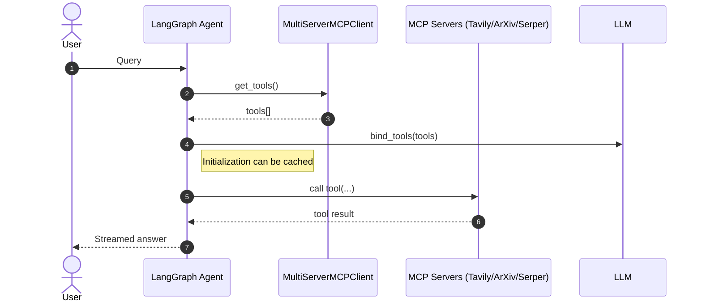

# Step 1 — Sequence

관련 Step: [../../steps/step1.md](../../steps/step1.md)

아래 다이어그램은 MCP 서버의 도구를 LangGraph 에이전트에 연결(get_tools → bind_tools)하고, 질의 처리 중 도구 호출이 이루어지는 흐름을 단순화해 보여줍니다.

```mermaid
sequenceDiagram
    autonumber
    actor U as User
    participant LG as LangGraph Agent
    participant MCP as MultiServerMCPClient
    participant MCPS as MCP Servers (Tavily/ArXiv/Serper)
    participant LLM as LLM

    U->>LG: Query
    LG->>MCP: get_tools()
    MCP-->>LG: tools[]
    LG->>LLM: bind_tools(tools)
    Note right of LG: Initialization can be cached

    LG->>MCPS: call tool(...)
    MCPS-->>LG: tool result
    LG-->>U: Streamed answer
```
