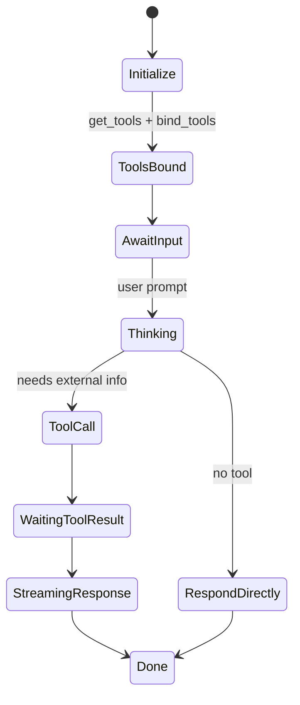

# Step 1 — State

관련 Step: [../../steps/step1.md](../../steps/step1.md)

```mermaid
stateDiagram-v2
    [*] --> Initialize
    Initialize --> ToolsBound: get_tools + bind_tools
    ToolsBound --> AwaitInput
    AwaitInput --> Thinking: user prompt
    Thinking --> ToolCall: needs external info
    ToolCall --> WaitingToolResult
    WaitingToolResult --> StreamingResponse
    StreamingResponse --> Done
    Thinking --> RespondDirectly: no tool
    RespondDirectly --> Done
```
