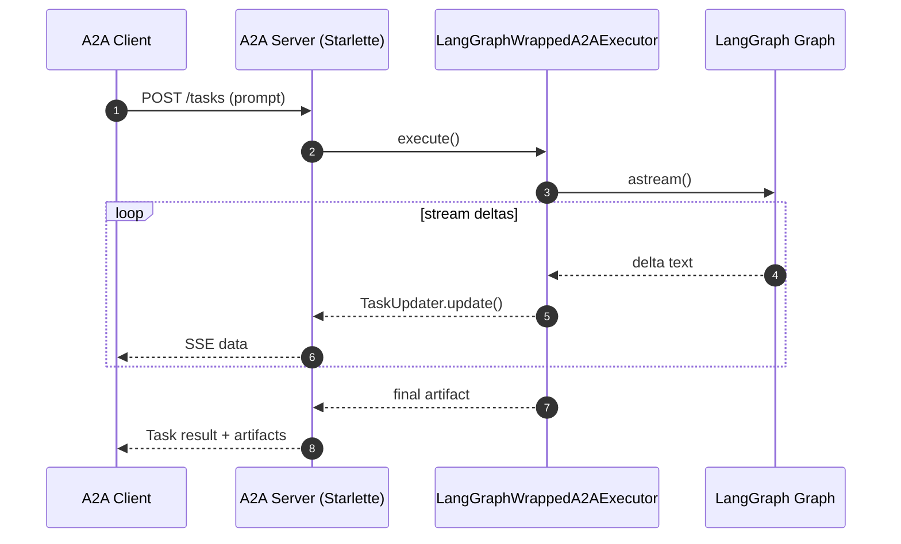

# Step 2 — Sequence

관련 Step: [../../steps/step2.md](../../steps/step2.md)

```mermaid
sequenceDiagram
    autonumber
    participant Client as A2A Client
    participant Server as A2A Server (Starlette)
    participant Exec as LangGraphWrappedA2AExecutor
    participant Graph as LangGraph Graph

    Client->>Server: POST /tasks (prompt)
    Server->>Exec: execute()
    Exec->>Graph: astream()
    loop stream deltas
      Graph-->>Exec: delta text
      Exec-->>Server: TaskUpdater.update()
      Server-->>Client: SSE data
    end
    Exec-->>Server: final artifact
    Server-->>Client: Task result + artifacts
```
