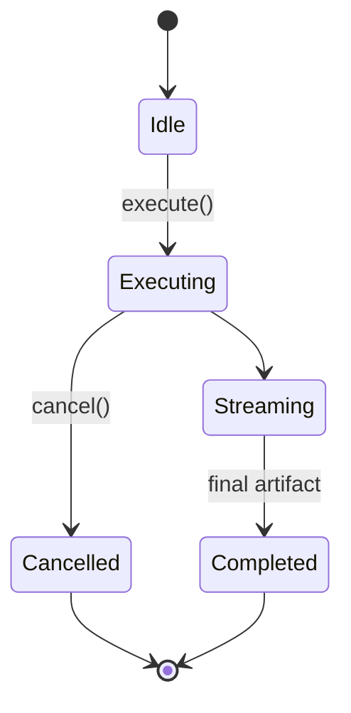

# Step 2 — State

관련 Step: [../../steps/step2.md](../../steps/step2.md)

```mermaid
stateDiagram-v2
    [*] --> Idle
    Idle --> Executing: execute()
    Executing --> Streaming
    Streaming --> Completed: final artifact
    Executing --> Cancelled: cancel()
    Cancelled --> [*]
    Completed --> [*]
```
