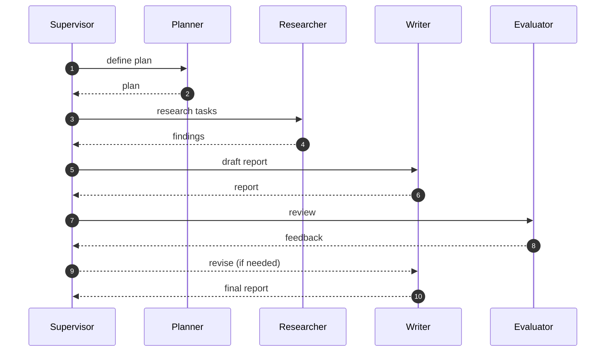

# Step 3 — Sequence

관련 Step: [../../steps/step3.md](../../steps/step3.md)

```mermaid
sequenceDiagram
    autonumber
    participant Sup as Supervisor
    participant Plan as Planner
    participant Res as Researcher
    participant W as Writer
    participant E as Evaluator

    Sup->>Plan: define plan
    Plan-->>Sup: plan
    Sup->>Res: research tasks
    Res-->>Sup: findings
    Sup->>W: draft report
    W-->>Sup: report
    Sup->>E: review
    E-->>Sup: feedback
    Sup-->>W: revise (if needed)
    W-->>Sup: final report
```
