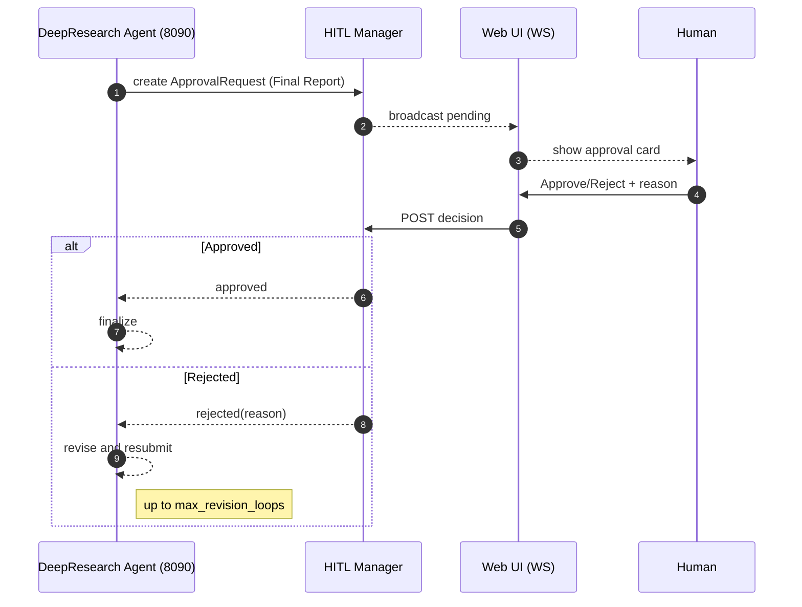

# Step 4 — Sequence

관련 Step: [../../steps/step4.md](../../steps/step4.md)

```mermaid
sequenceDiagram
    autonumber
    participant DR as DeepResearch Agent (8090)
    participant HITL as HITL Manager
    participant UI as Web UI (WS)
    participant Human

    DR->>HITL: create ApprovalRequest (Final Report)
    HITL-->>UI: broadcast pending
    UI-->>Human: show approval card
    Human->>UI: Approve/Reject + reason
    UI->>HITL: POST decision

    alt Approved
      HITL-->>DR: approved
      DR-->>DR: finalize
    else Rejected
      HITL-->>DR: rejected(reason)
      DR-->>DR: revise and resubmit
      note right of DR: up to max_revision_loops
    end
```
