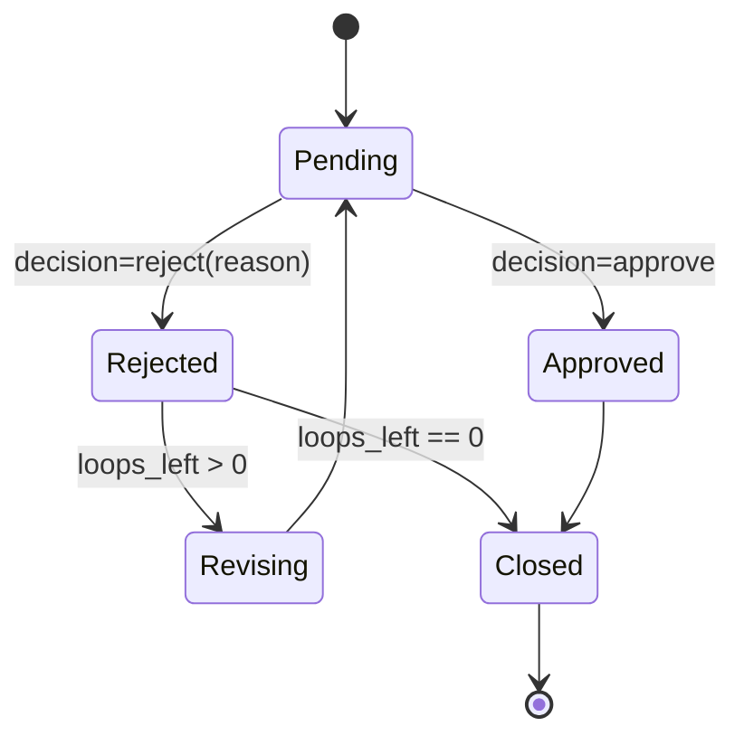

# Step 4 — State

관련 Step: [../../steps/step4.md](../../steps/step4.md)

```mermaid
stateDiagram-v2
    [*] --> Pending
    Pending --> Approved: decision=approve
    Pending --> Rejected: decision=reject(reason)
    Rejected --> Revising: loops_left > 0
    Revising --> Pending
    Rejected --> Closed: loops_left == 0
    Approved --> Closed
    Closed --> [*]
```
