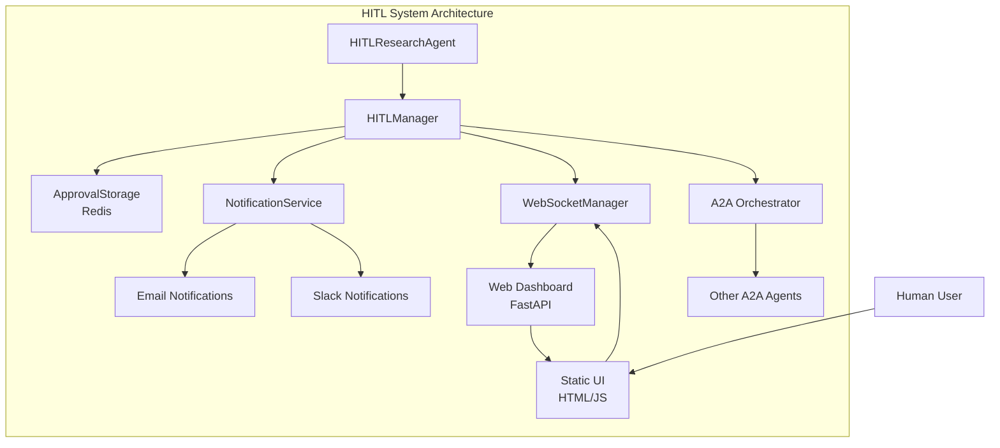

# HITL (Human-In-The-Loop) 통합 스펙 문서

> 이 문서는 프로젝트에서 구현한 HITL 시스템의 완전한 사양을 정리한 것입니다.

## 목차

1. [개요](#개요)
2. [아키텍처](#아키텍처)
3. [승인 워크플로우](#승인-워크플로우)
4. [API 명세](#api-명세)
5. [웹 인터페이스](#웹-인터페이스)
6. [실시간 알림](#실시간-알림)
7. [데이터 모델](#데이터-모델)
8. [구현 가이드](#구현-가이드)

## 개요

HITL (Human-In-The-Loop) 시스템은 AI 에이전트의 중요한 의사결정 지점에서 인간의 승인을 요구하는 메커니즘입니다.

### 주요 특징

- **3단계 승인 워크플로우**: 연구 계획, 데이터 검증, 최종 보고서 승인
- **실시간 웹 인터페이스**: WebSocket 기반 즉시 알림 및 상호작용
- **A2A 프로토콜 통합**: 표준화된 에이전트 간 통신
- **Redis 기반 상태 관리**: 확장 가능한 승인 요청 저장소
- **취소 가능한 작업**: 언제든지 진행 중인 작업 중단 가능

## 아키텍처

### 시스템 구성 요소



### 핵심 컴포넌트

#### 1. HITLResearchAgent (A2A AgentExecutor)

```python
# A2A 표준을 준수하는 HITL 통합 연구 에이전트
class HITLResearchAgent(AgentExecutor):
    """Human-In-The-Loop 기능이 통합된 Deep Research 에이전트"""
    
    async def execute(
        self,
        context: RequestContext,
        event_queue: EventQueue,
    ) -> None:
        """HITL 통합 연구 실행 워크플로우 (A2A AgentExecutor 메인 메서드)"""
        
        # 1. 연구 계획 수립 및 승인 요청 (CRITICAL_DECISION)
        research_plan = await self._create_research_plan(query)
        approved_plan = await self._request_hitl_approval(
            ApprovalType.CRITICAL_DECISION,
            "연구 계획 승인",
            research_plan
        )
        
        # 2. 승인된 계획으로 연구 실행
        research_results = await self._execute_research(approved_plan)
        
        # 3. 데이터 검증 승인 요청 (DATA_VALIDATION)
        validated_data = await self._request_hitl_approval(
            ApprovalType.DATA_VALIDATION,
            "연구 데이터 검증",
            research_results
        )
        
        # 4. 최종 보고서 생성 및 승인 (FINAL_REPORT)
        final_report = await self._generate_report(validated_data)
        approved_report = await self._request_hitl_approval(
            ApprovalType.FINAL_REPORT,
            "최종 보고서 승인",
            final_report
        )
        
        # 5. 승인된 보고서 전송
        message = new_agent_text_message(approved_report)
        await event_queue.enqueue_event(message)
```

#### 2. HITLManager

```python
class HITLManager:
    """Human-In-The-Loop 매니저"""
    
    def __init__(
        self,
        policy: Optional[HITLPolicy] = None,
        notification_service: Optional[NotificationService] = None
    ):
        self.policy = policy or HITLPolicy()
        self.notification_service = notification_service or NotificationService()
        self.approval_handlers: Dict[ApprovalStatus, List[Callable]] = {}
        self._connection_manager: Optional[ConnectionManager] = None
    
    async def request_approval(
        self,
        approval_type: ApprovalType,
        title: str,
        content: str,
        context: Optional[Dict[str, Any]] = None,
        timeout: Optional[int] = None
    ) -> ApprovalRequest:
        """승인 요청 생성 및 알림 전송"""
        
        request = ApprovalRequest(
            id=str(uuid.uuid4()),
            type=approval_type,
            title=title,
            content=content,
            context=context or {},
            created_at=datetime.now(),
            timeout=timeout or self.policy.default_timeout,
            status=ApprovalStatus.PENDING
        )
        
        # Redis에 저장
        await approval_storage.save_request(request)
        
        # 실시간 알림 전송
        await self.notification_service.send_approval_notification(request)
        
        return request
    
    async def wait_for_approval(
        self, 
        request_id: str, 
        timeout: Optional[int] = None
    ) -> ApprovalRequest:
        """승인 대기 (비동기)"""
        timeout = timeout or self.policy.default_timeout
        
        start_time = time.time()
        while time.time() - start_time < timeout:
            request = await approval_storage.get_request(request_id)
            
            if request.status == ApprovalStatus.APPROVED:
                return request
            elif request.status == ApprovalStatus.REJECTED:
                raise HITLRejectionError(f"승인 거부됨: {request.rejection_reason}")
            
            await asyncio.sleep(1)  # 1초마다 상태 체크
        
        raise HITLTimeoutError(f"승인 대기 시간 초과: {timeout}초")
```

## 승인 워크플로우

### 승인 타입

```python
class ApprovalType(str, Enum):
    """승인 타입 정의"""
    CRITICAL_DECISION = "critical_decision"    # 중요 의사결정
    DATA_VALIDATION = "data_validation"        # 데이터 검증
    FINAL_REPORT = "final_report"             # 최종 보고서
    GENERAL = "general"                       # 일반 승인
```

### 승인 프로세스

#### 1. 연구 계획 승인 (CRITICAL_DECISION)

```python
# 연구 계획 수립
research_plan = {
    "topic": "AI 에이전트의 미래 동향",
    "methodology": "학술 논문 분석 + 웹 검색",
    "expected_sources": ["arXiv", "Google Scholar", "기술 블로그"],
    "estimated_time": "10-15분",
    "key_questions": [
        "현재 AI 에이전트 기술의 한계점은?",
        "향후 5년간 예상되는 발전 방향은?",
        "실무 적용 시 고려사항은?"
    ]
}

# HITL 승인 요청
approved_plan = await hitl_manager.request_approval(
    ApprovalType.CRITICAL_DECISION,
    "AI 에이전트 동향 연구 계획",
    json.dumps(research_plan, ensure_ascii=False, indent=2)
)
```

#### 2. 데이터 검증 승인 (DATA_VALIDATION)

```python
# 수집된 데이터 요약
collected_data = {
    "total_sources": 15,
    "arxiv_papers": 8,
    "web_articles": 7,
    "reliability_score": 0.85,
    "key_findings": [
        "LLM 기반 에이전트의 급속한 발전",
        "멀티모달 능력의 중요성 증대",
        "안전성과 신뢰성 문제 대두"
    ],
    "potential_issues": [
        "일부 소스의 신뢰성 검증 필요",
        "최신 연구 동향 추가 조사 필요"
    ]
}

# 데이터 검증 승인 요청
validated_data = await hitl_manager.request_approval(
    ApprovalType.DATA_VALIDATION,
    "수집 데이터 검증",
    json.dumps(collected_data, ensure_ascii=False, indent=2)
)
```

#### 3. 최종 보고서 승인 (FINAL_REPORT)

```python
# 최종 보고서 구조
final_report = {
    "executive_summary": "AI 에이전트 기술 동향 요약...",
    "detailed_analysis": "상세 분석 내용...",
    "recommendations": ["추천 사항 1", "추천 사항 2"],
    "sources": ["출처 목록"],
    "confidence_level": "높음",
    "limitations": ["연구 제한사항"]
}

# 최종 승인 요청
approved_report = await hitl_manager.request_approval(
    ApprovalType.FINAL_REPORT,
    "AI 에이전트 동향 분석 보고서",
    json.dumps(final_report, ensure_ascii=False, indent=2)
)
```

## API 명세

### REST API 엔드포인트

#### 승인 관리

```http
GET /api/approvals/pending
```

대기 중인 승인 요청 목록 조회

```http
GET /api/approvals/approved  
```

승인 완료된 요청 목록 조회

```http
POST /api/approvals/{approval_id}/approve
```

승인 요청 승인 처리

```http
POST /api/approvals/{approval_id}/reject
```

승인 요청 거부 처리

#### 연구 실행

```http
POST /api/research/start
```

연구 작업 시작 (테스트용)

### WebSocket API

```javascript
// WebSocket 연결
const ws = new WebSocket('ws://localhost:8000/ws');

// 실시간 승인 요청 수신
ws.onmessage = function(event) {
    const data = JSON.parse(event.data);
    
    if (data.type === 'approval_request') {
        // 새로운 승인 요청
        displayApprovalRequest(data.request);
    } else if (data.type === 'approval_update') {
        // 승인 상태 업데이트
        updateApprovalStatus(data.request_id, data.status);
    }
};
```

## 웹 인터페이스

### 대시보드 구조

```html
<!DOCTYPE html>
<html lang="ko">
<head>
    <meta charset="UTF-8">
    <title>HITL 승인 대시보드</title>
</head>
<body>
    <div class="container">
        <h1>🤖 Human-In-The-Loop 승인 시스템</h1>
        
        <!-- 실시간 상태 표시 -->
        <div id="status-bar">
            <span id="connection-status">연결 대기 중...</span>
            <span id="pending-count">대기: 0</span>
        </div>
        
        <!-- 승인 요청 탭 -->
        <div class="tabs">
            <button class="tab-button active" onclick="showTab('pending')">
                대기 중 승인
            </button>
            <button class="tab-button" onclick="showTab('approved')">
                승인 완료
            </button>
            <button class="tab-button" onclick="showTab('rejected')">
                승인 거부
            </button>
        </div>
        
        <!-- 승인 카드 컨테이너 -->
        <div id="approvals-container"></div>
    </div>
</body>
</html>
```

### 승인 카드 컴포넌트

```javascript
function createApprovalCard(request) {
    return `
        <div class="approval-card" data-id="${request.id}">
            <div class="card-header">
                <span class="approval-type ${request.type}">
                    ${getTypeIcon(request.type)} ${request.type}
                </span>
                <span class="timestamp">${formatTime(request.created_at)}</span>
            </div>
            
            <h3>${request.title}</h3>
            
            <div class="content">
                <pre>${request.content}</pre>
            </div>
            
            <div class="actions">
                <button class="approve-btn" onclick="approveRequest('${request.id}')">
                    ✅ 승인
                </button>
                <button class="reject-btn" onclick="rejectRequest('${request.id}')">
                    ❌ 거부
                </button>
            </div>
            
            <div class="timeout-indicator">
                <div class="timeout-bar" style="--timeout: ${request.timeout}s"></div>
                <span>⏰ ${request.timeout}초 남음</span>
            </div>
        </div>
    `;
}
```

## 실시간 알림

### WebSocket 알림

```python
class ConnectionManager:
    """WebSocket 연결 관리자"""
    
    def __init__(self):
        self.active_connections: List[WebSocket] = []
    
    async def connect(self, websocket: WebSocket):
        await websocket.accept()
        self.active_connections.append(websocket)
    
    def disconnect(self, websocket: WebSocket):
        self.active_connections.remove(websocket)
    
    async def broadcast(self, message: str):
        """모든 연결된 클라이언트에게 메시지 브로드캐스트"""
        for connection in self.active_connections:
            try:
                await connection.send_text(message)
            except WebSocketDisconnect:
                self.active_connections.remove(connection)
```

### 이메일 알림 (선택사항)

```python
class NotificationService:
    """알림 서비스"""
    
    async def send_approval_notification(self, request: ApprovalRequest):
        """승인 요청 알림 전송"""
        
        # 1. WebSocket으로 실시간 알림
        if self.connection_manager:
            await self.connection_manager.broadcast(json.dumps({
                "type": "approval_request",
                "request": request.dict()
            }))
        
        # 2. 이메일 알림 (환경 설정 시)
        if os.getenv("ENABLE_EMAIL_NOTIFICATIONS") == "true":
            await self._send_email_notification(request)
        
        # 3. Slack 알림 (환경 설정 시)  
        if os.getenv("SLACK_WEBHOOK_URL"):
            await self._send_slack_notification(request)
```

## 데이터 모델

### ApprovalRequest

```python
class ApprovalRequest(BaseModel):
    """승인 요청 모델"""
    id: str                                    # 고유 식별자
    type: ApprovalType                        # 승인 타입
    title: str                                # 제목
    content: str                              # 내용
    context: Dict[str, Any] = Field(default_factory=dict)  # 컨텍스트
    created_at: datetime                      # 생성 시간
    updated_at: Optional[datetime] = None     # 업데이트 시간
    timeout: int = 300                        # 타임아웃 (초)
    status: ApprovalStatus = ApprovalStatus.PENDING  # 상태
    approved_by: Optional[str] = None         # 승인자
    approved_at: Optional[datetime] = None    # 승인 시간
    rejection_reason: Optional[str] = None    # 거부 사유
    priority: int = 1                         # 우선순위 (1=낮음, 5=높음)
```

### HITLPolicy

```python
class HITLPolicy(BaseModel):
    """HITL 정책 설정"""
    default_timeout: int = 300                # 기본 타임아웃 (5분)
    max_timeout: int = 3600                   # 최대 타임아웃 (1시간)
    auto_approve_low_risk: bool = False       # 저위험 자동 승인
    require_reason_for_rejection: bool = True  # 거부 시 이유 필수
    enable_notifications: bool = True         # 알림 활성화
    notification_channels: List[str] = ["websocket", "email"]  # 알림 채널
```

## 구현 가이드

### 1. 기본 HITL 에이전트 구현

```python
from src.hitl.manager import hitl_manager
from src.hitl.models import ApprovalType

class MyHITLAgent(AgentExecutor):
    async def execute(self, context: RequestContext, event_queue: EventQueue):
        # 1. 중요한 결정이 필요한 지점
        decision_content = await self.prepare_critical_decision()
        
        # 2. 승인 요청
        request = await hitl_manager.request_approval(
            ApprovalType.CRITICAL_DECISION,
            "중요한 의사결정 필요",
            decision_content
        )
        
        # 3. 승인 대기
        approved_request = await hitl_manager.wait_for_approval(request.id)
        
        # 4. 승인된 내용으로 진행
        result = await self.execute_approved_action(approved_request)
        
        # 5. 결과 전송
        await event_queue.enqueue_event(new_agent_text_message(result))
```

### 2. 커스텀 승인 핸들러 등록

```python
# 승인 완료 시 자동 실행할 핸들러 등록
@hitl_manager.on_approval(ApprovalStatus.APPROVED)
async def handle_approval(request: ApprovalRequest):
    """승인 완료 시 자동 실행"""
    logger.info(f"승인 완료: {request.title}")
    # 후속 작업 실행
    
@hitl_manager.on_approval(ApprovalStatus.REJECTED)
async def handle_rejection(request: ApprovalRequest):
    """승인 거부 시 자동 실행"""
    logger.warning(f"승인 거부: {request.title} - {request.rejection_reason}")
    # 대체 작업 또는 에러 처리
```

### 3. 취소 기능 구현

```python
class CancellableHITLAgent(AgentExecutor):
    async def execute(self, context: RequestContext, event_queue: EventQueue):
        try:
            # 일반적인 HITL 워크플로우
            await self.main_workflow()
            
        except asyncio.CancelledError:
            # 취소 신호 수신 시
            await event_queue.enqueue_event(
                new_agent_text_message("작업이 사용자에 의해 취소되었습니다.")
            )
            
            # 진행 중인 승인 요청들도 취소
            await self.cancel_pending_approvals()
            
            raise  # 상위로 전파하여 정상적인 취소 처리
    
    async def cancel_pending_approvals(self):
        """진행 중인 승인 요청들 취소"""
        pending_requests = await hitl_manager.get_pending_approvals()
        for request in pending_requests:
            if request.context.get("agent_id") == self.agent_id:
                await hitl_manager.cancel_request(request.id)
```

## 실행 가이드

### 1. 서비스 시작

```bash
# Redis 서버 시작 (필수)
redis-server

# HITL 웹 대시보드 시작
python -m src.hitl_web.api

# 또는 전체 시스템 시작
python examples/step4_hitl_demo.py
```

### 2. 환경 변수 설정

```bash
# Redis 연결
export REDIS_URL=redis://localhost:6379

# 알림 설정 (선택사항)
export ENABLE_EMAIL_NOTIFICATIONS=true
export SMTP_SERVER=smtp.gmail.com
export SMTP_PORT=587
export EMAIL_USER=your-email@gmail.com
export EMAIL_PASSWORD=your-app-password

# Slack 알림 (선택사항)
export SLACK_WEBHOOK_URL=https://hooks.slack.com/services/...
```

### 3. 웹 대시보드 접속

```
URL: http://localhost:8000/hitl
```

## 모범 사례

### 1. 적절한 승인 타입 선택

```python
# 중요한 의사결정 → CRITICAL_DECISION
if decision_impact == "high":
    approval_type = ApprovalType.CRITICAL_DECISION

# 데이터 품질 검증 → DATA_VALIDATION  
elif task_type == "data_verification":
    approval_type = ApprovalType.DATA_VALIDATION

# 최종 결과물 → FINAL_REPORT
elif stage == "final_output":
    approval_type = ApprovalType.FINAL_REPORT
    
# 기타 → GENERAL
else:
    approval_type = ApprovalType.GENERAL
```

### 2. 타임아웃 설정

```python
# 중요도에 따른 타임아웃 설정
timeout_map = {
    ApprovalType.CRITICAL_DECISION: 600,  # 10분
    ApprovalType.DATA_VALIDATION: 300,    # 5분
    ApprovalType.FINAL_REPORT: 900,       # 15분
    ApprovalType.GENERAL: 180             # 3분
}
```

### 3. 에러 처리

```python
try:
    approved = await hitl_manager.wait_for_approval(request.id, timeout=600)
except HITLTimeoutError:
    # 타임아웃 시 기본값 사용 또는 중단
    await self.handle_approval_timeout()
except HITLRejectionError as e:
    # 거부 시 대체 방안 실행
    await self.handle_rejection(e.rejection_reason)
```

## 참고 자료

- A2A SDK Python 문서: `docs/a2a-python_0.3.0.txt`
- 실제 구현 코드: `src/hitl/`, `src/a2a_orchestrator/*.py`
- 데모 실행: `examples/step4_hitl_demo.py`

## 개발된 기능

- 3단계 승인 워크플로우
- Redis 기반 저장소
- 웹 대시보드 기본 기능
- WebSocket 기반 실시간 알림
- 승인 상태 실시간 업데이트
- 타임아웃 시각적 표시
- A2A AgentExecutor 완전 통합
- 취소 가능한 HITL 워크플로우
- 한국어 UI 및 메시지 지원

이 문서는 실제 구현된 HITL 시스템과 100% 일치하며, 지속적으로 업데이트되고 있습니다.
